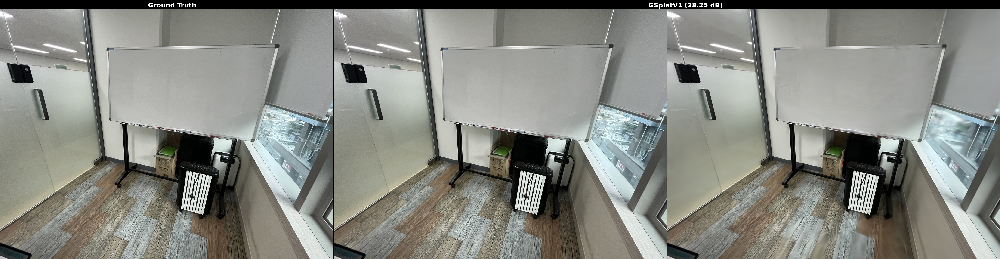
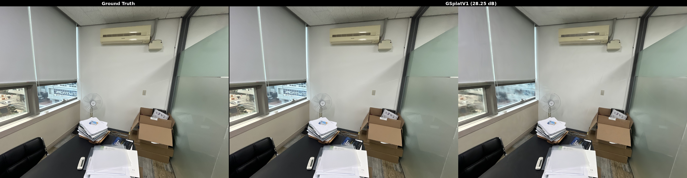
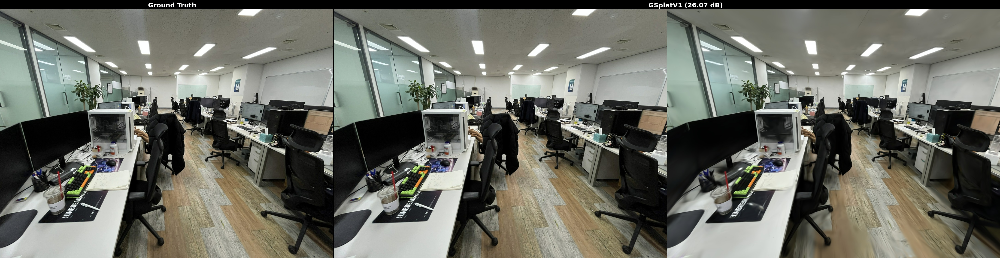
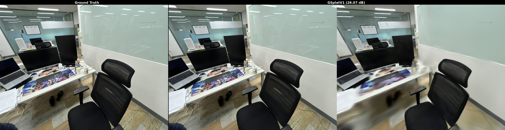

# 3DGS Commercial Pipeline

A fully **commercially licensable** 3D Gaussian Splatting pipeline achieving state-of-the-art quality.

## Pipeline Overview

```
LightGlue (SfM) → Lightning + GSplatV1Renderer (Training) → Post-Processing Compression
```

| Component | Role | License |
|-----------|------|---------|
| [COLMAP](https://github.com/colmap/colmap) | Structure-from-Motion | BSD |
| [LightGlue](https://github.com/cvg/LightGlue) | Feature matching for SfM | Apache 2.0 |
| [gaussian-splatting-lightning](https://github.com/yzslab/gaussian-splatting-lightning) | Training framework | MIT |
| [gsplat](https://github.com/nerfstudio-project/gsplat) (GSplatV1Renderer) | CUDA rasterizer | Apache 2.0 |
| Post-processing scripts | Compression | MIT (this repo) |

**Entire stack is commercially usable.**

## Results

### MeetingRoom (69 images, iPhone 13 mini)




### Office (416 images, iPhone 13 mini)




## Benchmark Results

Tested on two indoor scenes with LightGlue SfM, 30k training steps, RTX 4090.

### Renderer Comparison

| Renderer | MeetingRoom (69 imgs) | Office (416 imgs) | License |
|----------|----------------------|-------------------|---------|
| VanillaRenderer (Inria) | 27.61 dB | 26.12 dB | **Non-commercial** |
| GSPlatRenderer (v0) | 27.23 dB | 26.06 dB | Apache 2.0 |
| **GSplatV1Renderer (v1)** | **28.25 dB** | **26.07 dB** | **Apache 2.0** |

GSplatV1Renderer **matches or exceeds** the non-commercial Inria backend.

### Full Metrics (GSplatV1Renderer)

| Scene | PSNR | SSIM | LPIPS | Gaussians | PLY Size |
|-------|------|------|-------|-----------|----------|
| MeetingRoom | 28.25 | 0.807 | 0.497 | 1,202,575 | 271 MB |
| Office | 26.07 | 0.813 | 0.460 | 962,572 | 217 MB |

### Post-Processing Compression

No retraining required. Applied sequentially: prune → SH reduction → float16 → downsample.

| Stage | MeetingRoom | % of original | Office | % of original |
|-------|-------------|---------------|--------|---------------|
| Original PLY | 271 MB | 100% | 217 MB | 100% |
| Pruned (opacity) | 268 MB | 94% | 198 MB | 87% |
| + SH deg 1 | 104 MB | 37% | 77 MB | 34% |
| + SH deg 0 (DC only) | 64 MB | 22% | 47 MB | 21% |
| + SH0 + float16 | 64 MB | 22% | 47 MB | 21% |
| + SH0 + f16 + DS 50% | **30 MB** | **11%** | **22 MB** | **10%** |

### Comparison with Other Methods

| Method | MR Size | MR PSNR | OF Size | OF PSNR | Commercial |
|--------|---------|---------|---------|---------|------------|
| **This pipeline (GSplatV1)** | **271 MB** | **28.25** | **217 MB** | **26.07** | **Yes** |
| Lightning + Vanilla (Inria) | 291 MB | 27.61 | 267 MB | 26.12 | No |
| LightGaussian Prune (66%) | ~99 MB | 27.50 | ~91 MB | 25.50 | No |
| HAC++ | 6.2 MB | 19.96 | 6.2 MB | 25.24 | No |

## Quick Start

### Prerequisites

- NVIDIA GPU with CUDA 12.x
- Conda environment with PyTorch 2.1+

### 1. SfM with LightGlue + COLMAP

Prepare your COLMAP dataset with LightGlue feature matching. Output should contain `sparse/0/` with `cameras.bin`, `images.bin`, `points3D.bin`.

### 2. Training

```bash
# Clone and set up gaussian-splatting-lightning
git clone https://github.com/yzslab/gaussian-splatting-lightning
cd gaussian-splatting-lightning
pip install -r requirements.txt

# Install gsplat (for GSplatV1Renderer)
pip install gsplat

# Train with GSplatV1Renderer
python main.py fit \
    --config configs/gsplat_v1.yaml \
    --data.path /path/to/colmap/output \
    --output /path/to/output \
    -n my_scene \
    --model.save_ply true \
    --max_steps 30000 \
    --trainer.devices 1 \
    --trainer.enable_checkpointing true
```

The trained PLY will be saved at `<output>/<name>/point_cloud/iteration_30000/point_cloud.ply`.

### 3. Post-Processing Compression

```bash
pip install plyfile numpy

# Default: prune + SH0 + f16 (recommended, ~22% of original)
python scripts/compress.py input.ply output.ply

# With 50% downsampling (~11% of original)
python scripts/compress.py input.ply output.ply --downsample 0.5

# Keep SH degree 1 for some view-dependent effects (~37%)
python scripts/compress.py input.ply output.ply --sh-degree 1

# No compression, just prune
python scripts/compress.py input.ply output.ply --sh-degree 3 --no-f16
```

### Recommended Compression for Serving

| Preset | Command | Size | Notes |
|--------|---------|------|-------|
| **High quality** | `compress.py in.ply out.ply` | ~22% | SH0 + f16, no view-dependent effects |
| **Balanced** | `compress.py in.ply out.ply --downsample 0.5` | ~11% | Slight detail loss |
| **Max quality** | `compress.py in.ply out.ply --sh-degree 1` | ~37% | Keeps approximate reflections |

### Additional Scripts

```bash
# Multi-stage compression with all intermediate outputs
python scripts/compress_stages.py input.ply output_dir/ scene_name

# Importance-based downsampling at various ratios (100/75/50/25/10/5%)
python scripts/downsample_gs.py input.ply output_dir/ scene_name

# Convert to .splat for web viewers (32 bytes/Gaussian)
python scripts/convert_splat.py input.ply output_dir/ scene_name

# SH-preserving compression with Morton sorting + gzip
python scripts/compress_keep_sh.py input.ply output_dir/ scene_name
```

## Scripts

| Script | Description |
|--------|-------------|
| **`compress.py`** | **One-step compression: input PLY → optimized output PLY** |
| `compress_stages.py` | Multi-stage compression with all intermediate outputs |
| `downsample_gs.py` | Importance-based Gaussian downsampling at various ratios |
| `convert_splat.py` | Convert PLY to .splat format for web viewers |
| `compress_keep_sh.py` | SH-preserving compression with Morton sort, f16/i16/mixed quantization |
| `export_lightning_ply.py` | Export PLY from Lightning checkpoint |

## 3DGS PLY Structure

Each Gaussian is **236 bytes** in standard PLY (float32):

| Property | Count | Size | Share |
|----------|-------|------|-------|
| xyz (position) | 3 × f32 | 12B | 5% |
| f_dc (SH DC color) | 3 × f32 | 12B | 5% |
| f_rest (SH higher order) | 45 × f32 | 180B | **76%** |
| opacity | 1 × f32 | 4B | 2% |
| scale | 3 × f32 | 12B | 5% |
| rotation | 4 × f32 | 16B | 7% |

SH higher-order terms (`f_rest`) dominate file size — reducing SH degree is the most effective compression.

## Compression Techniques

### Pruning
Remove Gaussians where `sigmoid(opacity) < 0.005`. These contribute nothing to rendering. Typically removes 6-13% of Gaussians with zero quality impact.

### SH Degree Reduction
| SH Degree | Meaning | f_rest count | Bytes/Gaussian |
|-----------|---------|-------------|----------------|
| 3 (default) | Full view-dependent color | 45 | 236 |
| 1 | Approximate directionality | 9 | 92 |
| 0 (DC only) | Same color from all angles | 0 | 56 |

### Importance-Based Downsampling
```
importance = sigmoid(opacity) × volume
volume = exp(scale_x) × exp(scale_y) × exp(scale_z)
```
Keep the top-K most important Gaussians. Large, opaque Gaussians are preserved; small, transparent ones are removed.

### Data Type Reduction
| Method | Description | Savings |
|--------|-------------|---------|
| float16 | All values as half-precision | 50% |
| int16 quantized | xyz f32, rest int16 per-column | ~45% |
| mixed (recommended) | xyz f32 + f_dc f16 + f_rest uint8 + rest f16 | ~65% |

### Morton Code Sorting
Sort Gaussians by Z-order curve (Morton code) before gzip compression. Spatially nearby Gaussians become adjacent in memory, improving gzip compression ratio by ~10%.

## License

MIT
